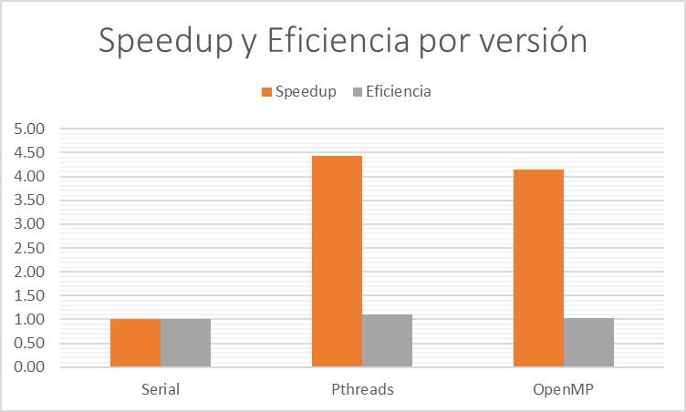

# Paralelización distribuida-híbrida

En la versión distribuida-híbrida se implementan las tecnologías `MPI` para
leer de forma distribuida los archivos de cada job en varios procesos y
`OpenMP` para transformar cada mapa concurrentemente a nivel de celda. La
implementación de la paralelización en este proyecto se caracteriza por la
naturalidad con la cual se ajusta al diseño serial. El que esto fuera
posible fue la meta principal a la hora de diseñar el algoritmo serial.

## Diseño Paralelo

### MPI

La concurrencia distribuida implementada se basa en la premisa de que, dados
varios archivos de entrada grandes, lo preferible es que la lectura de cada
uno pueda suceder de forma simultánea. Dada la imposibilidad de directamente
paralelizar la lectura de archivos dentro de un único proceso en C++, los
procesos distribuidos presentan una opción atractiva para llevar esto a cabo.

La descomposición, entonces, se centró alrededor de cada archivo como unidad
de trabajo. Estas unidades de trabajo son mapeadas a cada proceso en forma
híbrida de bloque y cíclico. Se apreció que la entrada de prueba que se nos
facilitó presentaba cierto patrón que no permitiría que un solo tipo de
mapeo manejara el job de la forma más eficiente.

El mapeo se implementó haciendo uso de la capacidad que dispone MPICH de
pasar los argumentos de la línea de comandos a cada proceso generado. Con
solo la dirección del archivo job, cada proceso lee únicamente los mapas que
coinciden con una fórmula que intenta distribuir equitativamente las líneas
del job, llamadas tasks en el código, a cada proceso, con el remanente
distribuido de forma cíclica.

    allTasks = [lista del archivo job]
	taskCount = allTasks.size
	remainder = taskCount % processCount
	mapsPerProcess = taskCount / processCount

Observamos en lo anterior como se preparan las cantidades necesarias para
dividir los tasks entre cada proceso. Seguidamente podemos ver cómo se toma,
funcionalmente, un subvector para cada proceso, en la forma de `myTasks`, y
luego se distribuyen los tasks remanentes calculando el punto de inicio para
los mismos uno después del último valor múltiplo del número de procesos.
Para simplificar esto último se explota la intuición que, a lo sumo, cada
proceso puede recibir un solo task remanente.

	taskStart = rank * mapsPerProcess
	taskEnd = (rank + 1) * mapsPerProcess

	myTasks = allTasks[taskStart, taskEnd)

	remainderStart = taskCount - remainder
	remainderPos = remainderStart + rank
	if ( remainderPos < taskCount)
	{
		myTasks.push(allTasks[remainderPos])
	}

### OpenMP

La concurrencia por hilos implementada aprovecha la estructura de matriz del
mapa, y la consecuencia que esto conlleva en la existencia de una ubicación
de memoria discreta para cada celda del mapa, para operar de forma orgánica
sobre el algoritmo serial, sin necesidad de controles de concurrencia, o algún
cambio al código.

La descomposición toma, naturalmente, cada celda como unidad de trabajo. El
mapeo utilizado es cíclico, realizado a través de la directiva `schedule
(static, 1)` que ofrece `OpenMP`. Se utiliza esta directiva en conjunto con
la directiva `collapse` para fácilmente distribuir cada celda entre los
hilos, ubicando las directivas directamente sobre el mismo bucle `for`
utilizado para la versión serial.

    #pragma omp parallel for collapse(2) schedule(static, 1)
        for (i = 0; i < rows; i++)
        {
            for (j = 0; j < cols; j++)
            {
                current = (i, j)
                next = nextTerrain(current) // Opera sobre el mapa original
                destArea[current] = next // Aplica al nuevo mapa por retornar
            }
        }

## Análisis de Rendimiento

## Metodología

Para todas las mediciones se utilizó el mismo job002.txt, como indica el enunciado. Las mediciones para la versión
serial se hicieron de forma local, mientras que todas las mediciones para la versión paralela se hicieron en el clúster
Kabré de la UCR, igualmente como indica el enunciado.

## Resultados

Se confirma que todas las versiones siempre retornen el mismo resultado.

### Comparación de optimizaciones

Los resultados completos para esta sección se pueden hallar en [la hoja de cálculo adjunta](./analisis/reporte.xlsx).

 

Lo que observamos parcialmente concuerda con lo que se esperaría según lo visto de momento en el curso. En cuanto al
speedup, observamos que la versión _Pthreads_ presenta una leve ventaja sobre la versión _OpenMP_, esto dado
probablemente al hecho de que, mientras la versión _Pthreads_ presenta concurrencia definida al momento de compilar, _
OpenMP_ define la concurrencia durante la ejecución. Dado que la diferencia es leve, y el algoritmo por iteración dentro
del `for` alrededor del cual se define el único uso de _OpenMP_ es efectivamente idéntico al `run()` dentro de cada hilo
en la versión _Pthreads_, este trabajo que se requiere para definir la concurrencia en cada iteración debería
representar, en conjunto, la totalidad de la diferencia en tiempo de ejecución entre estas versiones.

Por otro lado, en cuanto a la comparación entre las versiones concurrentes y la serial, observamos que la eficiencia
está anormalmente por encima de uno. Esto debido a que han habido cambios sustanciales en el algoritmo entre su
iteración serial, y su primera iteración concurrente, debido a la incapacidad del estudiante para entregar una versión
concurrente funcional a base del algoritmo de la versión serial inicialmente. Los cambios requeridos para hacer el
algoritmo funcional de forma concurrente problamente llegaron a accidentalmente optimizar la implementación.