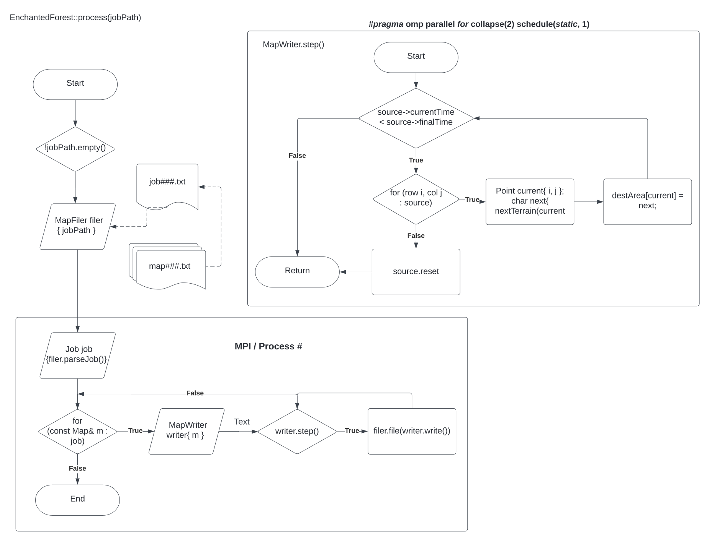

# Diseño Enchanted Forest

## Diseño de la aplicación distribuida-híbrida

El `EnchantedForest` con la versión distribuida-híbrida implementa
las siguientes tecnologías:
* `MPI`: Se implenta con el fin de procesar y distribuir los mapas de un
  determinado job entre los diferentes procesos.

* `OpenMP`: Se implenta con el propósito de procesar cada mapa realizando concurrencia con el
  objetivo de mejorar el rendimiento de la aplicación.

### MPI (Message Passing Interface)
MPI es una especificación para programación de paso de mensajes, que
proporciona una librería de funciones para C, C++ o Fortran que son
empleadas en los programas para comunicar datos entre procesos.

La `descomposición` es identificar unidades de trabajo que se pueden realizar
de forma independiente, en `EnchantedForest` se determino que las unidades de
trabajo que se puede realizar de forma independiente es la de resolver un mapa del
bosque encantado.

El `mapeo` es asignar esas unidades de trabajo a los trabajadores.
El `mapeo estático por bloque ` asigna rangos continuos de trabajo a
cada trabajador. Es el mapeo que potencialmente puede disminuir más fallos
de caché o false sharing.

    int rank{ -1 };
    MPI_Comm_rank(MPI_COMM_WORLD, &rank);

	int processCount{ -1 };
	MPI_Comm_size(MPI_COMM_WORLD, &processCount);

	size_t remainder{ 0 };
	size_t taskCount{ allTasks.size() };
	remainder = taskCount % static_cast<size_t>(processCount);

	size_t mapsPerProcess{ taskCount / processCount };
	size_t rankSizeT{ static_cast<size_t>(rank) };
	size_t taskStart{ rankSizeT * mapsPerProcess };
	size_t taskEnd{ (rankSizeT + 1) * mapsPerProcess };

	std::vector<std::string> myTasks(std::next(allTasks.begin(), taskStart),
			std::next(allTasks.begin(), taskEnd));

	size_t remainderStart{ taskCount - remainder };
	size_t remainderPos{ remainderStart + rankSizeT };
	if ( remainderPos < allTasks.size())
	{
		myTasks.push_back(allTasks[remainderPos]);
	}

### OpenMP
OpenMP es una API para la
programación multiproceso de memoria compartida en múltiples plataformas.
Permite añadir concurrencia a los programas escritos en C, C++

La `descomposición` es identificar unidades de trabajo que se pueden realizar
de forma independiente, en `EnchantedForest` se determino que las unidades de
trabajo que se puede realizar de forma independiente es la revisar
por terreno / celda cada una de las reglas existentes creadas por el mago.

El `mapeo` es asignar esas unidades de trabajo a los trabajadores.
El `El mapeo estático cíclico` asigna al trabajador i todas las
unidades de trabajo con índice {i,i+w,i+2w,...}.

Cláusulas utilizadas en el `EnchantedForest`

* COLLAPSE: especifica cuántos ciclos en un ciclo anidado deben colapsarse en
un espacio de iteración grande y dividirse de acuerdo con la cláusula de 
programación. La ejecución secuencial de las iteraciones en todos los 
ciclos asociados determina el orden de las iteraciones en el espacio de 
iteraciones colapsado.

* SCHEDULE(STATIC, 1): significa que los bloques de iteraciones se asignan 
estáticamente a los subprocesos de ejecución de forma rotativa.

    #pragma omp parallel for collapse(2) schedule(static, 1)
        for (size_t i = 0; i < rows; i++)
        {
            for (size_t j = 0; j < cols; j++)
            {
                Point current{ i, j };
                char next{ nextTerrain(current) };
                destArea[current] = next;
            }
        }

## Requisitos

### Funcionales:

* Recibir una carpeta con los siguientes archivos y su formato:
    1. Un job000.txt: Múltiples líneas, cada una con un nombre de archivo
       mapa, un espacio, y un número de medianoches por computar. El número
       de noches es positivo si se requiere trazabilidad, negativo si no.
    2. Varios map000.txt:
        1. Filas, espacio, columnas de la rep. de la isla.
        2. Matriz representativa de la isla. Contiene los siguientes caracteres:
            1. "a": árbol mágico
            2. "l": lago encantado
            3. "-": pradera

* Emitir archivos para cada mapa en el job. Los archivos de salida contienen
  el estado de la representación del mapa de la isla para un dado número de
  medianoches. Por lo tanto, el título de los archivos de salida es del
  formato: "map000-0.txt".

* Procesar cada mapa el número de medianoches solicitado en el job. El
  procesamiento consiste en aplicar las siguientes reglas para transformar
  el tablero en cada medianoche:
    1. "a" con >3 vecinos "l" -> "l"
    2. "l" con <3 vecinos "l" -> "-"
    3. "-" con >2 vecinos "a" -> "a"
    4. "a" con >4 vecinos "a" -> "-"

* Construir un bosque vacío con dimensiones de filas y columnas arbitrarias
  dadas por parámetro.
* Saber la cantidad de filas y columnas que hay en el bosque.
* Actualizar una celda del bosque en una medianoche. Considere un método
  privado que recibe por parámetros la fila y la columna que se quiere
  actualizar. El método actualiza la celda en medianoche de acuerdo a las
  reglas. Actualizar todo el bosque en una medianoche.
* Si el bosque es muy grande, permitir a dos o más trabajadores actualizar
  regiones distintas del bosque sin afectarse entre ellos, o trabajar en bosques
  distintos.

### Arquitecturales:

* Validar entradas.
* Utilizar estructuras de datos a la medida o adaptadas, con crédito.
* Hacer pruebas, así como análisis con las herramientas vistas en clase.
* Diseñar de forma desacoplada; preparar con UML.
* Manejar errores.

## Implementación

Se parte de estructuras de datos, `Map` y `Matrix`.

El `EnchantedForest` recibe archivos `job` para el procesamiento de los
archivos `map` descritos en su interior la cantidad de veces descrita junto
a los mismos, y su posterior escritura como archivos en el directorio de
salida. El propósito de cada una de sus partes respecto a los requisitos es el
siguiente:

| Clase     | Propósito                                                                           |
|-----------|-------------------------------------------------------------------------------------|
| MapFiler  | Validación de entradas. Conversión de archivo a `Job` y `Map` y de `Map` a archivo. |
| MapWriter | Edita los objetos `Map`, avanzando una iteración a la vez.                          |
| Logger    | Se encarga del logging a la consola.                                                |
| Map       | Contiene la información de una iteración de un mapa.                                |
| Matrix    | Representa el área de cada mapa en una matriz de caracteres.                        |
| Terrain   | Contiene aliases para los caracteres a utilizar en el mapa.                         |

### MapFiler

Un `MapFiler` consiste en un objeto que designa las operaciones de 
interacción con el sistema de archivos para un job dado. Cuenta con 
funciones `parseJob` y `file` en su interfaz pública. La primera devuelve un 
vector de `Map` en representación del contenido del archivo job. La segunda 
guarda en el sistema de archivos las representaciones de cada mapa generado 
haciendo uso de la información de sistema de archivos del archivo job.

### MapWriter

Un `MapWriter` consiste en un objeto que genera o modifica un `Map` dado. Se 
utiliza principalmente para generar el descendiente de un mapa. Cuenta con
funciones `write` y `step` en su interfaz pública. La primera devuelve una 
copia del mapa actualmente administrado por el writer. La segunda avanza en 
una iteración el estado de la matriz de área del mapa administrado.

### Map

Un `Map` consiste en un objeto que representa una unidad de trabajo para 
cualquier estado de mapa por utilizar en el transcurso de la simulación. 
Indica tanto el número de iteraciones que han sido procesadas, así como el 
número total de iteraciones por ser procesadas, eso además de guardar la 
información sobre si el linaje representado por objeto requiere trazabilidad 
en sus salidas, o no.

### Diagramas

