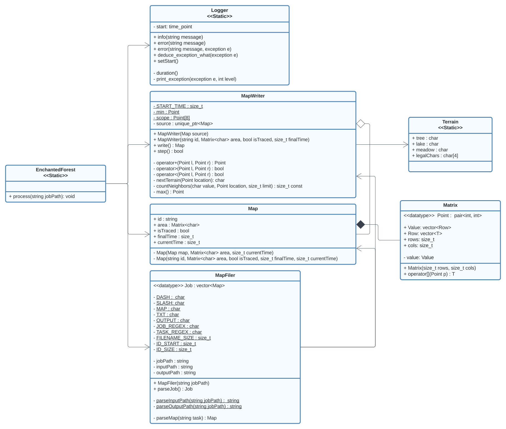
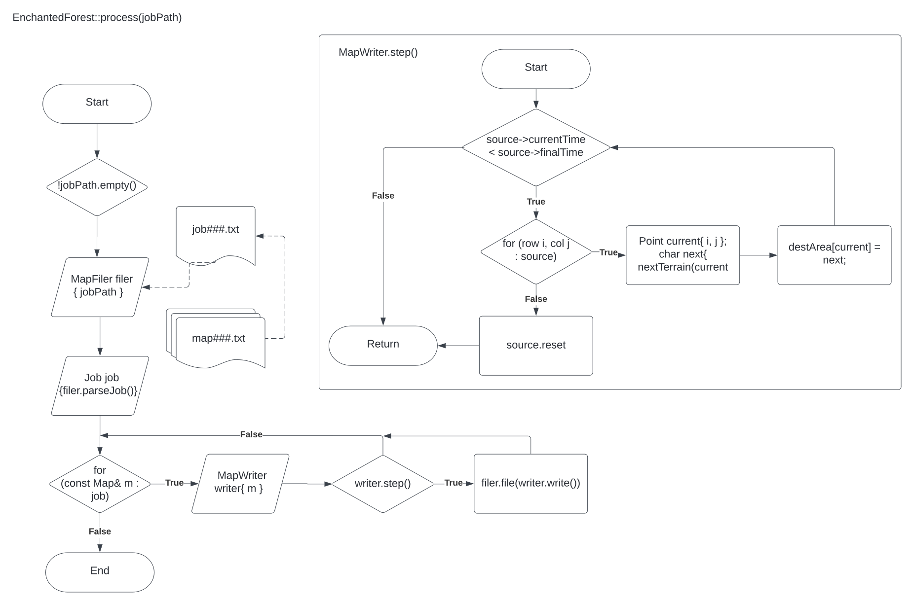

# Diseño Enchanted Forest

## Requisitos

### Funcionales:

* Recibir una carpeta con los siguientes archivos y su formato:
    1. Un job000.txt: Múltiples líneas, cada una con un nombre de archivo
       mapa, un espacio, y un número de medianoches por computar. El número
       de noches es positivo si se requiere trazabilidad, negativo si no.
    2. Varios map000.txt:
        1. Filas, espacio, columnas de la rep. de la isla.
        2. Matriz representativa de la isla. Contiene los siguientes caracteres:
            1. "a": árbol mágico
            2. "l": lago encantado
            3. "-": pradera

* Emitir archivos para cada mapa en el job. Los archivos de salida contienen
  el estado de la representación del mapa de la isla para un dado número de
  medianoches. Por lo tanto, el título de los archivos de salida es del
  formato: "map000-0.txt".

* Procesar cada mapa el número de medianoches solicitado en el job. El
  procesamiento consiste en aplicar las siguientes reglas para transformar
  el tablero en cada medianoche:
    1. "a" con >3 vecinos "l" -> "l"
    2. "l" con <3 vecinos "l" -> "-"
    3. "-" con >2 vecinos "a" -> "a"
    4. "a" con >4 vecinos "a" -> "-"

* Construir un bosque vacío con dimensiones de filas y columnas arbitrarias
  dadas por parámetro.
* Saber la cantidad de filas y columnas que hay en el bosque.
* Actualizar una celda del bosque en una medianoche. Considere un método
  privado que recibe por parámetros la fila y la columna que se quiere
  actualizar. El método actualiza la celda en medianoche de acuerdo a las
  reglas. Actualizar todo el bosque en una medianoche.
* Si el bosque es muy grande, permitir a dos o más trabajadores actualizar
  regiones distintas del bosque sin afectarse entre ellos, o trabajar en bosques
  distintos.

### Arquitecturales:

* Validar entradas.
* Utilizar estructuras de datos a la medida o adaptadas, con crédito.
* Hacer pruebas, así como análisis con las herramientas vistas en clase.
* Diseñar de forma desacoplada; preparar con UML.
* Manejar errores.

## Implementación

Se parte de estructuras de datos, `Map` y `Matrix`.

El `EnchantedForest` recibe archivos `job` para el procesamiento de los
archivos `map` descritos en su interior la cantidad de veces descrita junto
a los mismos, y su posterior escritura como archivos en el directorio de
salida. El propósito de cada una de sus partes respecto a los requisitos es el
siguiente:

| Clase     | Propósito                                                                           |
|-----------|-------------------------------------------------------------------------------------|
| MapFiler     | Validación de entradas. Conversión de archivo a `Job` y `Map` y de `Map` a archivo. |
| MapWriter | Edita los objetos `Map`, avanzando una iteración a la vez.                          |
| Logger    | Se encarga del logging a la consola.                                                |
| Map       | Contiene la información de una iteración de un mapa.                                |
| Matrix    | Representa el área de cada mapa en una matriz de caracteres.                        |
| Terrain   | Contiene aliases para los caracteres a utilizar en el mapa.                         |

### MapFiler

El algoritmo de `filer` consiste en la lectura y escritura de los contenidos de
un archivo por líneas. En el caso de lectura, las líneas son respectivamente
convertidas en las variables de un `GameState` para la construcción del
mismo. Esto se lleva a cabo a través de un número de ejecuciones de `cin`
basado en la especificación del archivo de entrada y el número de filas del
área de juego ASCII contenida en el mismo. Además, para el caso de escritura, se
lleva a cabo la necesaria funcionalidad de conversión de `PlayState` a
archivo a través de un proceso idéntico, pero inverso, al de lectura.

### Diagramas

