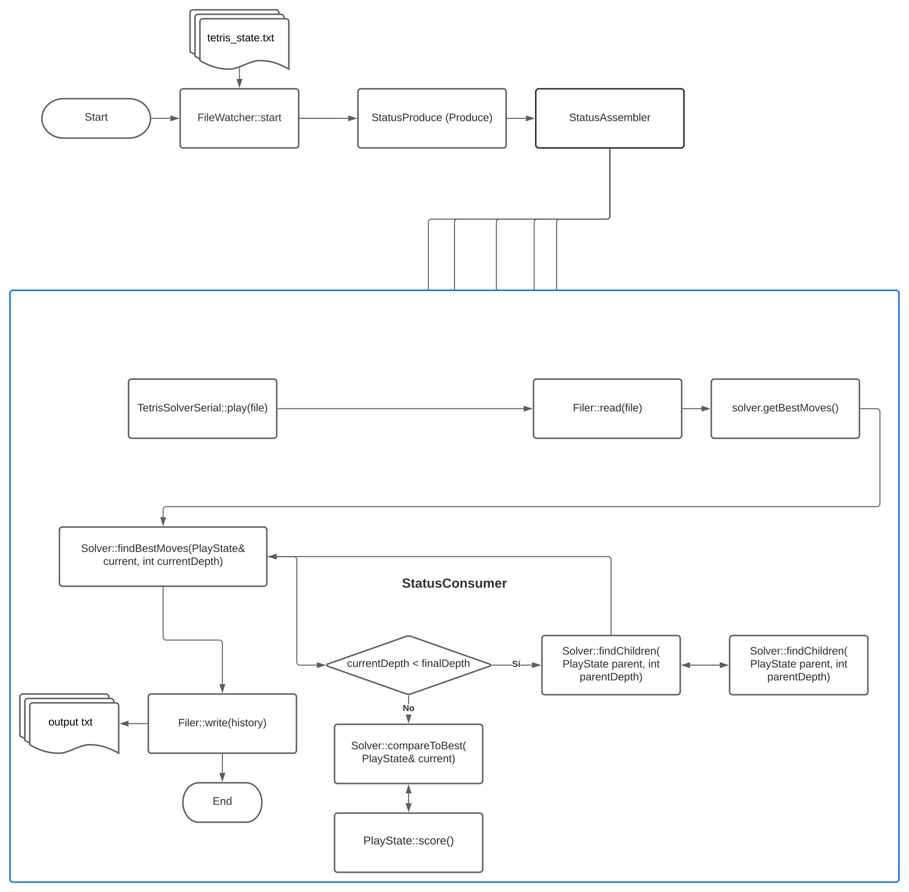

# Diseño Tetris Player

## Requisitos

### Funcionales:

* Recibir un archivo con el siguiente formato como entrada:
    1. ID
    2. Profundidad (D)
    3. Filas (N)
    4. Columnas (M)
    5. Área de juego (N x M)
    6. Número de formas siguientes (K)
    7. Una fila por cada forma siguiente con su caracter

* Emitir un archivo por cada nivel de profundidad ("tetris_play_d.txt") con el
  siguiente formato como salida:
    1. ID (Mismo)
    2. Caracter de la forma recién ubicada
    3. Número de rotación de la forma recién ubicada
    4. Filas
    5. Columnas
    6. Área de juego actualizada

* Retornar solamente las ubicaciones hasta llegar a algún nivel donde no haya
  solución
  válida. (Los/cuántos movimientos por imprimir se sabrán antes de iniciar la
  generación de archivos)

* Utilizar búsqueda en profundidad por D. En cada nivel:
    * Hallar puntajes para cada combinación de ubicación y orientación de la
      dada forma.
    * Repetir para cada posible subnivel, con su respectiva forma, a partir de
      cada una de las anteriores combinaciones.
    * Al terminar con un nivel, comparar cada combinación resultante, y retornar
      la de puntaje máximo.

* Paralelizar el programa para que haga un uso equilibrado de los recursos de la máquina.
  * Utilizar el patrón Productor-Consumidor
  * Productor coloca estados de Tetris en una cola y cada consumidor utiliza un Solucionador de Tetris.
  * Un consumidor toma una unidad de trabajo, inicia el solucionador y, una vez resuelto, vuelve a buscar otra unidad de trabajo en la cola

* Utilizar una heurística existente de las indicadas, y dar crédito, para
  determinar un "puntaje máximo".

### Arquitecturales:

* Implementar concurrencia
* Utilizar paradigma productor/consumidor.
* Validar entradas.
* Utilizar estructuras de datos a la medida o adaptadas, con crédito.
* No optimizar para tiempo de ejecución.
* Hacer pruebas, así como análisis con las herramientas vistas en clase.
* Diseñar de forma desacoplada; preparar con UML.

## Implementación

Se parte de una división entre el `FileWatcher` como punto de entrada al
`TetrisSolverSerial`, el cual se divide entre el `Filer` y el `Scorer`. Además,
se utilizan las siguientes estructuras de datos:

    GameState, PlayState, Matrix, Tetrimino

El `FileWatcher` lee archivos nuevos al directorio de entrada y se los pasa al
`TetrisSolverSerial` para el procesamiento de los mejores movimientos y su
procediente escritura como archivos en el directorio de entrada. En cuanto al
funcionamiento del `TetrisSolverSerial`, propósito de cada una de sus partes
respecto a los requisitos es el siguiente:

| Clase           | Propósito                                                                             |
|-----------------|---------------------------------------------------------------------------------------|
| GameState       | Contiene la información inicial del estado de juego.                                  |
| History         | Contiene la estructura de la unidad de trabajo.                                       |
| Matrix          | Contiene la forma de una area de juego como una matriz de caracteres.                 |
| PlayState       | Contiene la información de estado de una jugada.                                      |
| Tetrimino       | Contiene la forma de un tetrimino como una matriz de caracteres.                      |
| Manager         | Procesar estado de tetris de manera concurrente con el patron Productor - consumidor. |
| StatusConsumer  | Implementacion del Consumer y procesar una unidad de trabajo.                         |
| StatusAssembler | Implementacion del Assembler.                                                         |
| StatusProducer  | Implementacion del Producer y coloca unidades de trabajo a la cola.                   |
| StatusQueue     | Manejo las unidades de trabajo en la cola.                                            |
| Filer           | Validación de entradas. Conversión de archivo a `InState` y de `PlayState` a archivo. |
| FileWatcher     | Monitorea los cambios en el fichero e informa esos cambios al programa.               |
| Logger          | Gestionar mensajes del estado del programa.                                           |
| Solver          | Resolver una jugada de tetris.                                                        |
### FileWatcher

El `FileWatcher` corre con la función `start()`, punto a partir del cual
cualquier archivo con el nombre `tetris_state.txt` que sea movido a la
carpeta `./bin/put` será detectado a través de la biblioteca `inotify` de
Linux, y será enviado a procesar con el `TetrisSolverSerial`. Una vez que el
archivo sea procesado, se borra.

### FileEditor

El algoritmo de `FileEditor` consiste en la lectura y escritura de los contenidos de
un archivo por líneas. En el caso de lectura, las líneas son respectivamente
convertidas en las variables de un `GameState` para la construcción del
mismo. Esto se lleva a cabo a través de un número de ejecuciones de `cin`
basado en la especificación del archivo de entrada y el número de filas del
área de juego ASCII contenida en el mismo. Además, para el caso de escritura, se
lleva a cabo la necesaria funcionalidad de conversión de `PlayState` a
archivo a través de un proceso idéntico, pero inverso, al de lectura.

### código prodcons

Nuestra solución utiliza el código brindado por el profesor para facilitar la implementación de esta entrega.
el equipo tomó la decisión de realizar implementaciones de las siguientes clases: Queue, Producer, Consumer 
y Assembler.

### Solver
El algoritmo `Manager.proccessTetrisState(gameState)` es el punto de inicio en la solucion concurrente,
se encarga de procesar un GameState con el patron Productor - consumidor

### Play State

El algoritmo `PlayState.place( tetrimino, rotation, column )` explora la
topografía que trazan la celda no-vacía más alta de cada columna junto con las
celdas no-vacías más altas de *w-1* columnas a la derecha de la original, donde
*w* es el ancho del `tetrimino` específico que se esté intentando ubicar de
forma válida en el área de juego `matrix` del `PlayState`. Se asume, según los
lineamientos de la tarea, que sólo es necesario que esta "silueta", así como los
bordes del área de juego, no obstruyan el cuerpo del `tetrimino` si este se
ubicase en el punto inicial de anclaje a la izquierda. El `place`, entonces,
intenta agregar el `tetrimino` de forma válida, y si lo logra, retorna `true`, y
de lo contrario, `false`.

### Solver

    History Solver::solve(const GameState& gameState) {
      statusQueue = std::make_unique<TQueue>();
      startProducer(gameState);
      producer->waitToFinish();
      startAssemblers(gameState);
      waitForAssemblers();
      if (highScore)
      {
          return *highScore;
      }
      else
      {
          throw std::domain_error("No valid moves down to requested depth.");
      }
    }

#### StatusConsumer

Consume cada elemento en la cola. Maneja cada objeto WorkState colocando la última permutación y permutando o comparando
el objeto WorkState resultante.

#### StatusProducer

Producre cada elemento en la cola.

### Diagramas

#### Version Serial

#### Version Concurrente

