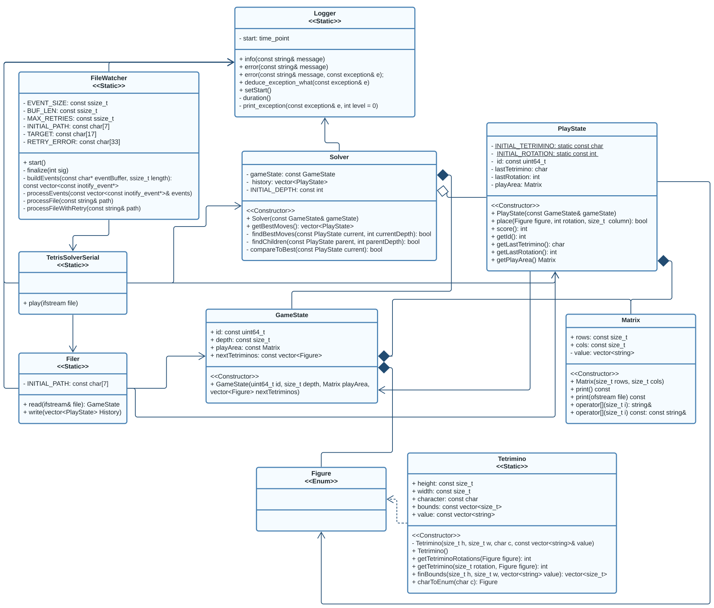

# Diseño

## Requisitos

### Funcionales:

* Recibir un archivo con el siguiente formato como entrada:
    1. ID
    2. Profundidad (D)
    3. Filas (N)
    4. Columnas (M)
    5. Área de juego (N x M)
    6. Número de formas siguientes (K)
    7. Una fila por cada forma siguiente con su caracter

* Emitir un archivo por cada nivel de profundidad ("tetris_play_d.txt") con el siguiente formato como salida:
    1. ID (Mismo)
    2. Caracter de la forma recién ubicada
    3. Número de rotación de la forma recién ubicada
    4. Filas
    5. Columnas
    6. Área de juego actualizada

* Retornar solamente las ubicaciones hasta llegar a algún nivel donde no haya solución
  válida. (Los/cuántos movimientos por imprimir se sabrán antes de iniciar la generación de archivos)

* Utilizar búsqueda en profundidad por D. En cada nivel:
    * Hallar puntajes para cada combinación de ubicación y orientación de la dada forma.
    * Repetir para cada posible subnivel, con su respectiva forma, a partir de cada una de las anteriores combinaciones.
    * Al terminar con un nivel, comparar cada combinación resultante, y retornar la de puntaje máximo.

* Utilizar una heurística existente de las indicadas, y dar crédito, para determinar un "puntaje máximo".

### Arquitecturales:

* Validar entradas.
* Utilizar estructuras de datos a la medida o adaptadas, con crédito.
* No optimizar para tiempo de ejecución.
* Hacer pruebas, así como análisis con las herramientas vistas en clase.
* Diseñar de forma desacoplada; preparar con UML.
* Utilizar mapeo de bloque o mapeo dinámico para asignar a los hilos sus tareas.

## Implementación

Se parte de la siguiente división para la lógica del programa:

    filer, in_state_factory, scorer, play_state_factory,
    tetrimino_factory, matrix_factory

Además, se utilizan las siguientes estructuras de datos:

    in_state, play_state, matrix, tetrimino

Para las cuales se evita usar "_t" como sufijo a los nombres de los tipos definidos por `typedef`
según [la recomendación de The Open Group Base Specifications](https://pubs.opengroup.org/onlinepubs/9699919799/xrat/V4_xsh_chap02.html#:~:text=The%20requirement%20that%20additional,additional%20types%20is%20compelling.)
, basándose en las características del estándar de POSIX.
El propósito de cada una de estas partes respecto a los requisitos es el siguiente:

| Archivo            | Propósito                                                                                                                                                                                                         |
|--------------------|-------------------------------------------------------------------------------------------------------------------------------------------------------------------------------------------------------------------|
| Filer              | Validación de entradas. Conversión de archivo a `in_state` y de `play_state` a archivo. Conecta con `matrix_factory` y `in_state_factory`.                                                                        |
| Scorer             | Navega las permutaciones de los `play_state` y puntúa cada `play_state.play_area` a partir de [la heurística de Takado8](https://github.com/takado8/Tetris). Conecta con `matrix_factory` y `play_state_factory`. |
| In State Factory   | Manipule y administra estructuras `in_state`. Conecta con `filer`.                                                                                                                                                |
| Play State Factory | Manipula y administra estructuras `play_state`, `matrix` y `tetrimino`. Determina si un `play_state` es válido. Conecta con `scorer` y `matrix_factory`, `tetrimino_factory`.                                     |
| Tetrimino Factory  | Manipula y administra estructuras `tetrimino`. Conecta con `play_state_factory`.                                                                                                                                  |
| Matrix Factory     | Manipula y administra estructuras `matrix`. Conecta con `filer`, `scorer` y `play_state_factory`.                                                                                                                 |

### Filer

El algoritmo de `filer` consiste en la lectura y escritura de los contenidos de un archivo por líneas. En el caso de
lectura, las líneas son respectivamente convertidas en las variables de un struct `in_state` para la construcción del
mismo. Esto se lleva a cabo a través de un número de ejecuciones de `fscanf` basado en la especificación del archivo de
entrada y el número de filas del área de juego ASCII contenida en el mismo. Además, para el caso de escritura, se lleva
a cabo la necesaria funcionalidad de conversión de `play_state` a archivo a través de un proceso idéntico, pero inverso,
al de lectura.

### Play State Factory

El algoritmo `play_state_factory.place( play_state*, tetrimino*, rotation, column )` explora la topografía que trazan la
celda no-vacía más alta de cada columna junto con las celdas no-vacías más altas de *j-1* columnas a la derecha de la
original, donde *j* es el ancho del `tetrimino` específico que se esté intentando ubicar de forma válida en el área de
juego `matrix` del `play_state` que recibe. Se asume, según los lineamientos de la tarea, que sólo es necesario que
esta "silueta", así como los bordes del área de juego, no obstruyan el cuerpo del `tetrimino` si este se ubicase en el
punto inicial de anclaje a la izquierda. El `play_state_factory`, entonces, intenta agregar el `tetrimino` de forma
válida, y si lo logra, retorna un 1, de lo contrario, 0.

### Scorer

#### Score
El algoritmo `score` se basa totalmente en la heurística para Tetris delineada por Takado8 en la página de Github
enlazada anteriormente. Se explora el área de juego `matrix`, inicialmente, para determinar cada uno de los criterios
mencionados en la heurística. Se procede a determinar estos criterios de la siguiente forma:

* Se ubica la frontera entre las líneas completadas, y las incompletas, esto en la forma de una altura primaria,
  definida como desde antes de la primera fila, hasta después de la última fila completa. Esta altura representa el
  *número de líneas completadas* `complete_lines`.
* Se suma el exceso en cada columna por encima de la altura primaria. Esta suma representa la *altura sumada de
  columnas* `height`,
* Se exploraría la matriz del área de juego arriba de la altura primaria, contando el número de celdas que pertenecen a
  un espacio completamente cerrado. Este sería el *número de hoyos* `holes`.
* Se sumará la diferencia en altura respecto a la altura primaria entre la celda no-vacía más arriba de cada columna y
  la de su vecina derecha. Con esto determinamos la *diferencia sumada de altura de columnas adyacentes*, o
  rugosidad `bumpiness`,

Así, llegamos a un valor de puntaje para cada área de juego procesada de la forma:

    score = height * a + complete_lines * b + holes * c + bumpiness * d

Donde los valores `a`, `b`, `c`, y `d` fueron determinados de antemano por Takado8 utilizando un algoritmo genético,
para valores finales, después de varias horas, de:

    a = -0.798752914564018
    b = 0.522287506868767
    c = -0.24921408023878
    d = -0.164626498034284

Para los cuales ya el algoritmo lograba completar hasta 2000 líneas en una sola partida.

#### Find Best Moves
El algoritmo `find_best_moves` se ocupa de navegar las permutaciones de cada 
estado de juego a partir del estado de juego inicial. En cada nivel de 
profundidad, empezando desde el -1, se hallan todos los posibles estados de 
juego hijos/permutación del estado de juego de entrada con el método 
`find_best_child`, y al llegar al nivel de profundidad indicado en el 
archivo de entrada como el máximo se puntúa el estado de juego, y se 
compara con el puntaje del estado de juego de puntaje máximo, guardado en 
el arreglo `history` usando el método `comparte_to_best`. A la hora de ir 
subiendo de vuelta los niveles de profundidad, el valor de retorno de 
`find_best_moves` indica si en el siguiente nivel más profundo al actual se 
halló un estado de juego de puntaje máximo, o `HI_SCORE`, en cuyo caso se 
agrega el estado de nivel actual al arreglo `history`.

    find_best_moves(in_state *initial, play_state *current,
                    play_state **history, int current_depth)
    final_depth = initial->depth;
    if (current_depth < final_depth)
        child_hs = find_best_child(initial, current_depth, current, history)
        if (current_depth > -1 && HI_SCORE == child_hs)
            history[current_depth] = copy_play_state(current);
        return child_hs;
    else if (current_depth == final_depth)
        return compare_to_best(final_depth, current, history);
    else
        return EXIT_FAILURE;
    
También cabe destacar que es precisamente este método el que los hilos son 
capaces de ejecutar de forma individual, esto a partir del nivel cero de 
profundidad de búsqueda.

### Diagrama

